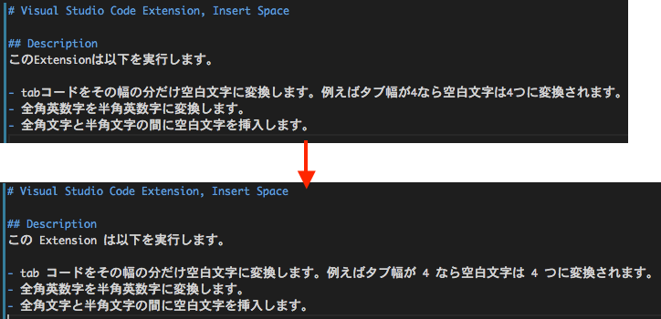

# Visual Studio Code Extension, InsertSpace
オオオ

イイイ

.gitignore, vscodeignore が ignore されるわ

## Description
この Extension は UTF-8 が前提で以下を実行します。(英文合ってる?)

- tab コード (\t) をその幅の分だけ空白文字に変換します。例えばタブ幅が 4 なら空白文字は 4 つに変換されます。
- Convert tab code to white space. For example if tab width is 4, this extension converts to 4 white space.
- 全角文字 (! から ~) を半角文字に変換します。
- Convert full wide char that's char code is from '!' to '~' to half wide char.
- 全角文字と半角英数字の間に空白文字を挿入します。(下図参照)
- Insert white space between full wide char and half wide char. Please see following picture.

## Installing
* Mac
    1. Download clone and unarchive
    2. mv InsertSpace-master $HOME/.vscode/extensions/
    3. Launch VSCode

* Windows
    1. Download clone and unarchive
    2. Move InsertSpace-master to \Users\xxxxx\.vscode\extensions\
    3. Launch VSCode

## Usage
    1. Press F1 key
    2. Input "Insert Space"

or

    1. ctrl+s

## License
Copyright (c) 2016 tkumata

This software is release under the MIT License, please see [MIT](http://opensource.org/licenses/mit-license.php)

## Author
[tkumata](https://github.com/tkumata)

## Thanks
[TabSpacer](http://qiita.com/YuichiNukiyama/items/3b928a67248fe5c9a5ba)
